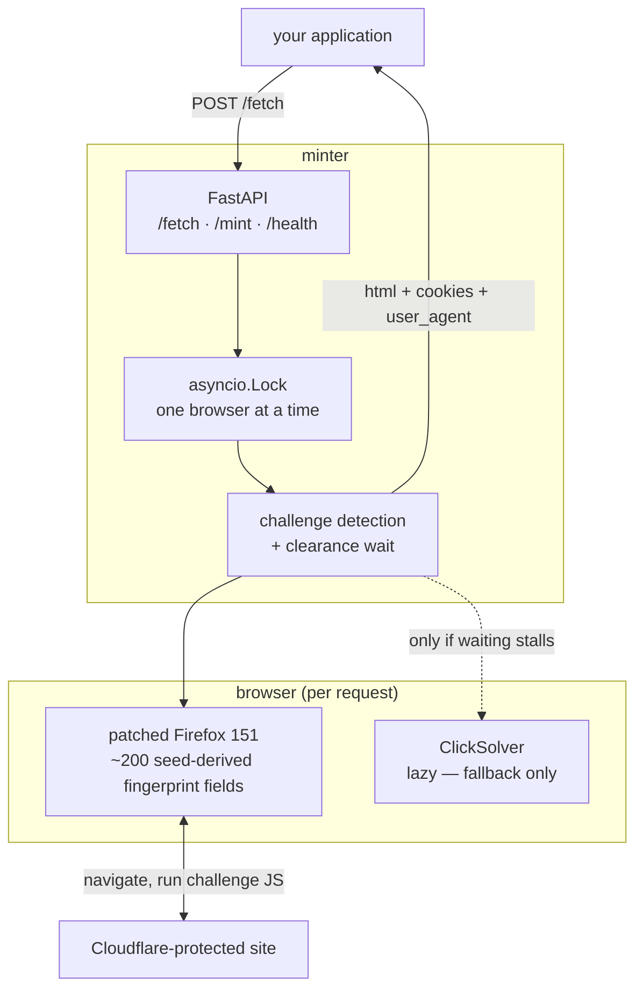
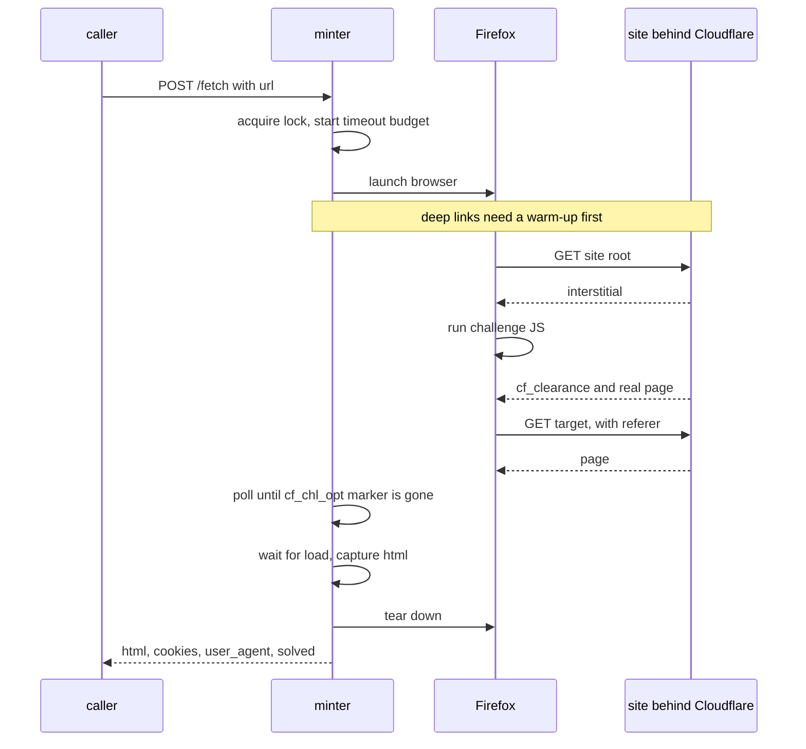

# minter

A small service that gets you past Cloudflare's browser challenge — either as a
**clearance cookie** or as the **rendered HTML** of the page you wanted.

It is a deliberately narrow alternative to [FlareSolverr](https://github.com/FlareSolverr/FlareSolverr)
and [Byparr](https://github.com/ThePhaseless/Byparr): two endpoints, no proxy
protocol, no compatibility envelope.

```
POST /fetch  {"url": "https://example.com/page"}  →  {"html": "...", "solved": true}
POST /mint   {"url": "https://example.com/"}      →  {"cookies": [...], "user_agent": "..."}
```

## Quick start

```bash
docker run --rm -p 8191:8191 --shm-size=512m ghcr.io/dulsaranethmin/minter:latest
```

```bash
curl -s -X POST localhost:8191/fetch \
  -H 'content-type: application/json' \
  -d '{"url":"https://example.com/"}' | jq '{solved, elapsed_ms}'
```

Or with Compose — `compose.yaml` pulls the published image, so nothing needs building:

```bash
docker compose up -d
```

Three things worth knowing before you hit them:

- **`--shm-size=512m` is required.** Docker's 64 MB default is not enough for Firefox, and the
  failure looks like a random browser crash rather than a configuration problem.
- **The image is ~2.2 GB.** Firefox accounts for 564 MB, its system libraries 596 MB, and the GeoIP
  database 119 MB. That is the floor for shipping a real browser, not bloat waiting to be trimmed.
- **Do not expose port 8191 to the internet.** These endpoints fetch any URL they are given, from
  your IP, with no authentication. Bind it to a private network.

### Tags and platforms

| Tag | What it is |
|---|---|
| `latest` | The most recent release |
| `0.1.0`, `0.1` | Pinned release |
| `edge` | Latest commit on `main` — may be broken |
| `sha-<short>` | An exact commit |

Built for **`linux/amd64`** and **`linux/arm64`**. There is no 32-bit ARM build:
`invisible-playwright` publishes only `linux-x86_64` and `linux-arm64` Firefox assets, so older
32-bit Pis cannot run this at all.

> **On the name.** This started out as a cookie *minter*: obtain `cf_clearance`
> once, then replay it cheaply from an ordinary HTTP client. Measurement killed
> that plan — Cloudflare binds the cookie to a TLS fingerprint no off-the-shelf
> client reproduces (see [below](#why-the-browser-runs-per-request)) — so `/fetch`
> became the endpoint that works and `/mint` stayed for callers who can match the
> fingerprint. The name is a fossil of the original idea, kept because it is short.

---

## How it works

`minter` drives a stealth-patched Firefox. The anti-detection is not this project's
code — it comes from [`invisible-playwright`](https://pypi.org/project/invisible-playwright/),
which ships a Firefox built with its fingerprints compiled **into the engine**
rather than injected into the page. This service is the orchestration around it:
lifecycle, challenge detection, timeouts, and a narrow HTTP surface.



### The request flow

The key insight is that Cloudflare's non-interactive interstitial **clears itself**
once a sufficiently real browser executes its JavaScript. There is nothing to click.
Clicking is only needed for the interactive variant, so the solver is a fallback
rather than the main path.



### Why the browser runs per request

`cf_clearance` cannot be handed to an ordinary HTTP client. Cloudflare binds it to
the **exit IP, User-Agent and TLS fingerprint** of whatever obtained it, and the
patched Firefox 151 has no equivalent in uTLS. Measured against `tls.peet.ws`:

| | patched Firefox 151 | uTLS `HelloFirefox_Auto` (= FF 120) |
|---|---|---|
| JA3 | `6447ab086255d194909d4013b1a89e87` | `b5001237acdf006056b409cc433726b0` |
| JA4 | `t13d1617h2_86a278354501_…` | `t13d1715h2_5b57614c22b0_…` |
| HTTP/2 | `1:65536;2:0;4:131072;5:16384` | `2:0;4:4194304;5:16384;6:10485760` |

The browser also offers TLS extensions `18` and `27` and curve `4588`
(X25519MLKEM768) that Firefox 120 predates. All three fingerprints differ, and a
reused cookie is rejected with a 403 indistinguishable from having no cookie.

`/mint` is still provided for callers that *can* reproduce the fingerprint, but
**`/fetch` is the endpoint that works**.

---

## Does it work on other sites?

**Yes — there is no site-specific code.** Both endpoints take an arbitrary URL, and
the deep-link warm-up derives the site root from that URL. Verified unchanged
against `example.com` (no protection), `nowsecure.nl` (a standard Cloudflare
bot-detection test) and `1337x.to` (active interstitial).

What varies is not the site but the **challenge type**:

| Challenge | Supported | Notes |
|---|:--:|---|
| Non-interactive interstitial (*"Just a moment…"*) | ✅ | The common case. Clears passively in ~3–8 s |
| Interactive Turnstile | ❌ | Tested against `ext.to` and it does not clear. Returns **502** naming the type |
| Managed challenge with a real CAPTCHA | ❌ | Needs a paid API solver; not wired up |
| Hard block (Error 1020, IP ban) | ❌ | Not a challenge — nothing to solve |
| DataDome / PerimeterX / Akamai | ❌ | Different vendors entirely |

Cloudflare states which one you are facing in `cType` on the challenge page:
`non-interactive` clears itself and works here; `interactive` mounts a Turnstile
widget and does not. When a challenge fails to clear, the 502 detail reports the
`cType` it saw, so you can tell "unsupported challenge" apart from "something broke":

```
502  challenge not cleared for https://ext.to/… (cType=interactive (turnstile widget)).
     Interactive Turnstile is not solvable by this service.
```

Detection is deliberately locale-independent. It keys on the `cf_chl_opt` and
`__cf_chl` markers rather than the page title, because with `BROWSER_LOCALE=auto`
the browser adopts the exit IP's language and an English title match would silently
fail behind a VPN. Measured on real pages, those markers appear 7× and 3× on an
interstitial and 0× once cleared.

So: pointing it at a new Cloudflare-protected site needs **no code changes**. A
different anti-bot vendor needs a different tool.

---

## API

### `POST /fetch`

Fetch a page, clearing any challenge first. This is what most callers want.

```jsonc
// request
{ "url": "https://example.com/search/thing/1/", "timeout": 120 }

// response
{
  "solved": true,          // a challenge was present AND cleared
  "html": "<!DOCTYPE html>…",
  "final_url": "https://example.com/search/thing/1/",
  "user_agent": "Mozilla/5.0 (Windows NT 10.0; …) Firefox/151.0",
  "elapsed_ms": 7878
}
```

### `POST /mint`

Return the clearance cookies instead of the page. Only useful if your client can
present the same TLS fingerprint — see the table above.

```jsonc
{
  "solved": true,
  "cookies": [ { "name": "cf_clearance", "domain": ".example.com", … } ],
  "user_agent": "Mozilla/5.0 … Firefox/151.0",
  "elapsed_ms": 6139
}
```

Returns **502** if no `cf_clearance` scoped to the target host was issued, and
**408** if the timeout budget runs out. `/fetch` likewise returns **502** rather
than handing back an uncleared interstitial as a 200. A cookie scoped to `.cloudflare.com` does
not count — that one is always present and is useless for the target site.

### `GET /health`

Drives a real browser end to end, returning `{"ok": true, "version": "0.1.0", "user_agent": "…"}`.
Slow by design; not a liveness ping. Quote the `version` in bug reports.

---

## Running from source

```bash
uv sync
uv run python main.py          # http://localhost:8191
```

Building the image instead of pulling it:

```bash
docker compose -f compose.yaml -f compose.dev.yaml up --build
```

Interactive API docs are at `/docs`. The container idles at ~125 MB RSS and peaks
around 450 MB while a browser is running.

### A quick search example

`search.sh` demonstrates the intended use — fetch, then parse on your side:

```bash
./search.sh "Interstellar"
```

---

## Configuration

| Variable | Default | Purpose |
|---|---|---|
| `HOST` | `0.0.0.0` | Bind address |
| `PORT` | `8191` | Listen port |
| `LOG_LEVEL` | `INFO` | Logging level |
| `MAX_ATTEMPTS` | `5` | ClickSolver attempts before giving up |
| `DEFAULT_TIMEOUT` | `60` | Seconds per request |
| `BROWSER_LOCALE` | `auto` | BCP-47 tag; `auto` derives from the exit IP |
| `BLOCK_MEDIA` | `true` | Skip images/fonts/video while solving |
| `PROXY_SERVER` | — | Optional upstream proxy |

Leave `BROWSER_LOCALE` on `auto`: a locale that disagrees with the exit IP is
itself a detection signal.

---

## Design notes

Four decisions that differ from FlareSolverr and Byparr, each for a measured reason.

**One browser at a time.** An `asyncio.Lock` serialises requests; concurrent callers
queue rather than launching parallel Firefox instances. On small hardware three at
once means swapping. The timeout budget starts *after* the lock is acquired, so a
queued caller is not charged for waiting.

**The solver is lazy.** Entering `ClickSolver` installs handlers on the page, and
doing so eagerly stops the non-interactive interstitial clearing on its own — every
request degrades into five failed click attempts. It is now constructed only when
passive waiting has already failed.

**Clearance is judged by the page, not the cookie.** `cf_clearance` is set *before*
the interstitial hands over to the real document. Acting on the cookie leaves the
site mid-clearance and the next request lands on a challenge that never resolves.

**Deep links warm up first.** Navigating cold to `/some/deep/path` reliably yields
an interstitial that never clears, while the site root clears in seconds. Requests
therefore land on the root first and follow through with a referer — which is also
what a real user does.

**Stateless.** No cookie cache. Callers own that, so this service can be restarted
or rebuilt without losing anything.

---

## Limitations

- **It is an arms race.** When Cloudflare changes, the fix comes from
  `invisible-playwright` upstream and you take the version bump.
- **Only Cloudflare**, and only the challenge types in the table above.
- **The User-Agent is not stable.** A fresh persona is derived per session, so
  consecutive calls return different User-Agents (often a Windows one regardless of
  host). Always pair a cookie with the UA from the same response; never hardcode it.
- **The Ubuntu base is pinned to 24.04.** `ubuntu:latest` floats to 26.04, for which
  Playwright cannot install Firefox dependencies.

---

## Development

```bash
uv run pytest                 # all tests, including one live 1337x fetch
uv run pytest -m 'not live'   # unit tests only, no browser
uv run ruff check .
```

CI runs lint and the unit tests. The `live` test is deliberately excluded there — it
drives a real browser against a third-party site, so it stays a local pre-release check.

### Cutting a release

The version is declared in two places and CI fails the release if a tag disagrees with
either, so bump both:

```bash
# pyproject.toml   version = "0.2.0"
# src/minter/__init__.py   __version__ = "0.2.0"

uv run pytest                 # including the live test
git commit -am "release: v0.2.0"
git tag v0.2.0 && git push --follow-tags
```

Pushing the tag builds `linux/amd64` and `linux/arm64` on native runners and publishes
`0.2.0`, `0.2` and `latest`. Pushes to `main` publish `edge`.

---

## Credits

The approach follows [ThePhaseless/Byparr](https://github.com/ThePhaseless/Byparr).
The anti-detection comes from
[`invisible-playwright`](https://pypi.org/project/invisible-playwright/) and
[`playwright-captcha`](https://pypi.org/project/playwright-captcha/) — this project
is the orchestration around them, not the evasion itself.

## License

MIT
